<!-- Typing animation (external service, optional) -->

 

---

## 🛠️ Tech Stack

## 📊 GitHub Stats

## 🚀 Featured Projects

| Project | Description | Tech |
|---|---|---|
| [Project One](https://github.com/MeetMal/project-one) | Short description of what it does | Python |
| [Project Two](https://github.com/MeetMal/project-two) | Short description of what it does | JavaScript |
| [Project Three](https://github.com/MeetMal/project-three) | Short description of what it does | C++ |

## 🐍 Contribution Snake

<!-- The snake appears after the GitHub Action in .github/workflows/snake.yml runs once -->

⭐ Thanks for stopping by!

